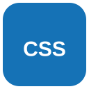
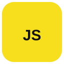
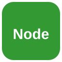
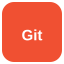

<div align="center">

# 👋 Hi, I'm Bright

### 💻 Fresher Full Stack Developer

Building web applications with **JavaScript, React, Node.js & databases**.

<br>


<br>











<br><br>


</div>

---

## 👨‍💻 About Me

I'm a **Fresher Full Stack Developer** who enjoys building web applications and learning modern web technologies.

- 🌱 Currently improving my **JavaScript** skills
- ⚛️ Building user interfaces with **React**
- 🟢 Building backend applications with **Node.js & Express**
- 🗄️ Working with **MySQL, PostgreSQL & MongoDB**
- 🔧 Using **Git & GitHub** for version control
- 🚀 Interested in building real-world Full Stack applications

---

## 🛠️ Tech Stack

### 🎨 Frontend

<p>
  
  
  
  
</p>

### ⚙️ Backend

<p>
  
  
</p>

### 🗄️ Database

<p>
  
  
  
</p>

### 🔧 Tools

<p>
  
  
</p>

---

## 📚 Currently Learning

```text
JavaScript
    ↓
React
    ↓
Node.js + Express
    ↓
REST API
    ↓
MySQL / PostgreSQL / MongoDB
```

---

## 📊 GitHub Stats

<div align="center">


</div>

---

## 🔥 GitHub Streak

<div align="center">


</div>

---

## 📫 Connect With Me

<div align="center">

<a href="https://github.com/brightnguyen-nqs">
  
</a>

</div>

---

<div align="center">

### 💡 "Keep learning. Keep building. Keep improving."

⭐ Thanks for visiting my profile!

</div>
